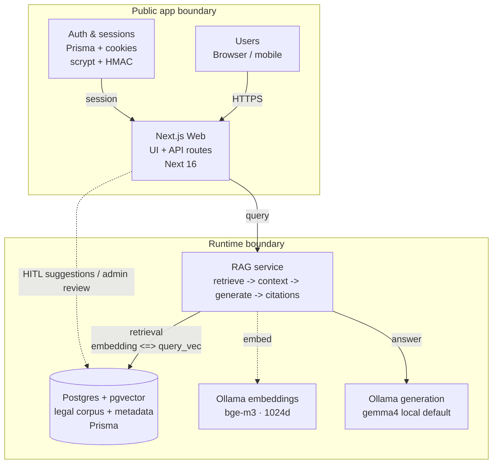
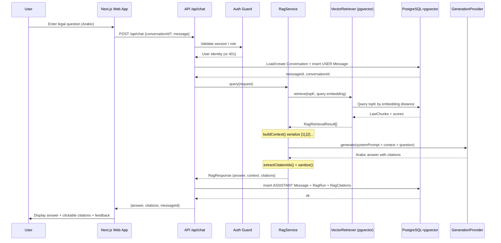
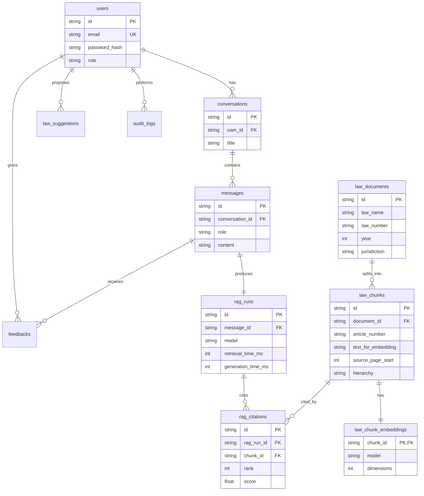

# Egyptian Legislation RAG — A Retrieval-Augmented Generation System for Egyptian Legal Question Answering

> **Experimental prototype, not legal advice.** Answers are grounded in the ingested corpus with article-level citations. Always verify against the governing article.

Chat with Egyptian legislation (Labour, Financial, Personal-Affairs laws) in Arabic: retrieval-augmented generation over a Postgres + pgvector corpus, served by a Next.js app, with Ollama providing embeddings (`bge-m3`) and generation (`gemma4:cloud`).

**Keywords:** Retrieval-Augmented Generation, Egyptian Law, Arabic NLP, Semantic Search, Vector Search, Legal QA, pgvector, Human-in-the-Loop.

## Contents

- [1. What Is This Project](#1-what-is-this-project)
- [2. How to Run](#2-how-to-run)
- [3. System Design](#3-system-design)
- [4. Why Vector Search over BM25 & Hybrid](#4-why-vector-search-over-bm25--hybrid)
- [5. Final Results & Evaluation](#5-final-results--evaluation)
- [6. Repository Map & Tech Stack](#6-repository-map--tech-stack)
- [7. Limitations & Future Work](#7-limitations--future-work)

---

## 1. What Is This Project

### 1.1 Problem

Access to Egyptian law is a retrieval + generation problem: provisions are scattered across long statutes, written in formal Arabic with article/section hierarchy, OCR noise, and diacritic/tatweel variation, while users ask conversational natural-language questions. Keyword search and manual navigation miss paraphrases, morphological variants, and cross-article conditions/exceptions.

### 1.2 Solution

An experimental, source-aware RAG system integrating three domains — **Labour Law, Financial Law, Personal-Affairs Law** — into a common article-oriented corpus:

- **Article-level chunking (not char splitting):** each `LawChunk` preserves legal identity — law, article number/title, hierarchy, full legal text, embedding text, source order, provenance (`source_file`, `page_start/end`), and processing metadata. Conditions, exceptions, penalties, and cross-references stay together.
- **Semantic runtime:** query → `bge-m3` 1024-d embedding → Postgres + pgvector cosine search (`<=>`) → source-aware context (`[1]`, `[2]`, …) → Arabic answer via Ollama-compatible LLM (`gemma4` local default) with extracted article-level citations.
- **Human-in-the-loop maintenance:** registered users suggest additions/edits; admins review and maintain directly. An approved change generates a fresh embedding for the affected article, then updates article + embedding transactionally with audit records. Maintenance is data management, not retraining.
- **Arabic-first UX:** RTL chat, loading states, source cards (law, article, source file, page), conversation history, feedback buttons.

### 1.3 Scope and non-goals

- Covers the three ingested domains only — not full Egyptian legislation, no Official Gazette sync.
- No legal certification; does not replace a lawyer.
- Local-first inference (no mandatory cloud account); `gemma4:cloud` is an opt-in override.

---

## 2. How to Run

### 2.1 Quick demo (prebuilt image, no source build)

Prerequisites: [Docker](https://docs.docker.com/get-docker/) and [Ollama](https://ollama.com/download). Disk: ~650 MB app image + ~1.1 GB `bge-m3` + several GB for `gemma4`.

```bash
git clone https://github.com/I-Maged/egyptian-legislation-RAG-v3.git && cd egyptian-legislation-RAG-v3
bash scripts/setup-recruiter.sh   # creates .env with generated secrets

ollama pull bge-m3
ollama pull gemma4                # local model, no account needed

# Pre-seeded legal corpus: download corpus-public.dump from the latest
# GitHub Release and save it as packages/db/seed/data/corpus.dump
# (see packages/db/seed/data/README.md). Optional but recommended —
# without it the app boots with an empty database.

docker compose -f docker-compose.pull.yml up -d
```

Open **http://localhost:3000** (liveness probe: `/api/health`).
First start takes a few minutes (seed restore + migrations); follow it with
`docker logs egyptian-law-rag-postgres-1` and `docker logs egyptian-law-rag-web-1`.
To stop: `docker compose -f docker-compose.pull.yml down`.

| What                                                       | Where                             |
| ---------------------------------------------------------- | --------------------------------- |
| Demo compose (prebuilt `magedhanafy/egyptian-law-rag-web`) | `docker-compose.pull.yml`         |
| Build-from-source compose (contributors)                   | `docker-compose.yml`              |
| Seed dump instructions                                     | `packages/db/seed/data/README.md` |
| RAGAS evaluation (local Python, not containerized)         | `evaluation/ragas/README.md`      |

Notes:

- Ollama is **external**, not containerized. Inside Docker, `localhost` means the web container, so the app talks to Ollama via `OLLAMA_HOST` (default `http://host.docker.internal:11434`, mapped on Linux too via `extra_hosts`).
- Cloud generation models (e.g. `GENERATION_MODEL=gemma4:cloud`) are an opt-in override: they need `ollama signin` (Ollama.com account) plus internet, and Ollama occasionally retires them. The default is the local `gemma4`.
- Images: Postgres (`pgvector/pgvector`) is multi-arch. The web image is currently `linux/amd64` (Apple Silicon runs it via Rosetta 2); `linux/arm64` is planned — see `docker-compose.yml` to build natively.
- To re-seed from scratch: `docker compose -f docker-compose.pull.yml down -v` (**deletes** the demo database volume), place the dump, then `up -d`.
- Maintainers: the quickstart above needs a GitHub Release containing `corpus-public.dump` (sanitized public corpus — see `packages/db/seed/data/README.md`); without it, step 2 has nothing to download.
- Config reference: [`.env.example`](.env.example) (`POSTGRES_*`, `WEB_PORT=3000`, `AUTH_SECRET`, `OLLAMA_HOST`, `EMBEDDING_MODEL=bge-m3`, `GENERATION_MODEL=gemma4`). Use URL-safe `POSTGRES_PASSWORD` (no `@ : / ? #`).

### 2.2 For contributors (build from source)

```bash
cp .env.example .env   # then fill POSTGRES_PASSWORD + AUTH_SECRET
docker compose up --build -d
```

Local dev (without Docker) still uses `packages/db/docker-compose.yml` for Postgres plus `apps/web/.env.local`. See `evaluation/ragas/README.md` for the Python evaluator.

### 2.3 Tests

```bash
npx vitest run
```

Requires the dev database to be up **and migrated with data**: start `packages/db/docker-compose.yml`, then `prisma migrate deploy` in `packages/db/` (schema only is not enough — the `bm25`/`vector`/`hybrid` suites query real corpus rows; restore `packages/db/seed/data/corpus.dump` or ingest). Also unset any `OLLAMA_*`/`EMBEDDING_*`/`GENERATION_*` env vars in the test shell: provider defaults fall back to them and assertions expect the localhost defaults. Live-Ollama suites stay skipped unless their `RUN_*=1` flags are set.

---

## 3. System Design

### 3.1 Runtime architecture



**Request path:** browser → Next.js → auth-guarded `/api/chat` → RAG service (`retrieve topK=10 → buildContext [1],[2] → generate → extractCitationIds`) → Postgres + pgvector, grounded by `bge-m3` embeddings and `gemma4:cloud` generation. Offline evaluation (internal benchmark + RAGAS) probes the same RAG service without changing prompts or chunking.

### 3.2 Ingestion → query data flow

1. **Parse:** `packages/ingestion/src/parser/` (`pdfjs-dist`, Arabic normalization / diacritic strip, Qwen recovery) → `data/input/`, `data/pdf/`, `data/raw/`.
2. **Canonicalize:** `packages/ingestion/src/canonical/` → validated `LawChunk {id, article_number/title, text, text_for_embedding, hierarchy[], provenance, source_order}` → `data/canonical/`.
3. **Embed:** `POST {OLLAMA_HOST}/api/embed {model: bge-m3}` → 1024-d vectors → `data/embeddings/reindex-v3.3.0/` + `manifest.json`.
4. **Index DB:** `reindex-db` (`loadCanonicalCorpora` → `assertEmbeddingIntegrity` → `upsertCorpus` → `replaceEmbeddingIndex`) populates `law_documents → law_chunks → law_chunk_embeddings(vector(1024))`.
5. **Query:** `POST /api/chat` → `getRagService()` → `embed(query)` → `PostgresVectorRetriever.search()` → `BaselineReranker` (`0.45 exactPhrase + 0.35 termCoverage + 0.20 normRetrieval`) → `buildContext()` → `OllamaGenerationProvider.chat()` → `sanitize + extractCitationIds()` → persist `Message + RagRun + RagCitation` → `{answer, citations, messageId}`.

Retrieval modes in code (benchmark/eval only except vector): vector cosine (`vector.repository.ts`), BM25 (`to_tsvector('simple') @@ to_tsquery`, Arabic stopword strip; in-memory `k1=1.2, b=0.75`), hybrid RRF fusion (`rrfK=60`, in-memory; `hybrid.repository.ts` is a thin vector wrapper). Production and final eval use **vector-only** (`topK=10`, candidate `topK=40` for RAGAS export).

### 3.3 Request sequence



Auth: `scrypt(salt:hash)` + `HMAC-SHA256` cookie `law_session` (7d TTL); `/admin*` ADMIN-only, `/api/chat|conversations|messages` require `getCurrentUser()` → `401`. Docker entrypoint fails fast without `AUTH_SECRET`/`DATABASE_URL`, retries `prisma migrate deploy`.

### 3.4 Data model



Provenance chain: `law_documents → law_chunks (+embeddings) → rag_citations → rag_runs → messages → conversations → users`, plus governance `feedbacks / law_suggestions / audit_logs`.

---

## 4. Why Vector Search over BM25 & Hybrid

BM25 struggles here with Arabic morphology, paraphrase (“إجازة” vs “عطلة”), diacritic/tatweel noise, and article-identifier queries; hybrid RRF adds a second index + fusion tuning without consistent gain. Vector search (`bge-m3` shared Q↔article space, pgvector `<=>`) is the only system with **zero misses in top-10 across all three laws**, matches or beats hybrid on `R@3/R@5/nDCG`, and is simpler/cheaper to operate.

### Financial Law (65 queries)

| system | R@1    | R@3    | R@5    | R@10   | P@5    | P@10   | MRR    | nDCG@5 | nDCG@10 |
| ------ | ------ | ------ | ------ | ------ | ------ | ------ | ------ | ------ | ------- |
| bm25   | 0.6846 | 0.8615 | 0.9231 | 0.9538 | 0.1877 | 0.0969 | 0.7917 | 0.8222 | 0.8315  |
| vector | 0.8231 | 0.9692 | 0.9846 | 1.0000 | 0.2000 | 0.1015 | 0.8928 | 0.9140 | 0.9195  |
| hybrid | 0.8385 | 0.9538 | 0.9692 | 0.9846 | 0.1969 | 0.1000 | 0.9032 | 0.9187 | 0.9236  |

Diagnostic: `bm25 62/3 missed | vector 65/0 | hybrid 64/1`.

### Labour Law (65 queries)

| system | R@1    | R@3    | R@5    | R@10   | P@5    | P@10   | MRR    | nDCG@5 | nDCG@10 |
| ------ | ------ | ------ | ------ | ------ | ------ | ------ | ------ | ------ | ------- |
| bm25   | 0.6615 | 0.7846 | 0.8308 | 0.9077 | 0.1662 | 0.0908 | 0.7428 | 0.7564 | 0.7825  |
| vector | 0.8308 | 0.9615 | 0.9923 | 0.9923 | 0.2000 | 0.1000 | 0.9044 | 0.9249 | 0.9249  |
| hybrid | 0.7692 | 0.9385 | 0.9692 | 0.9923 | 0.1938 | 0.1000 | 0.8586 | 0.8832 | 0.8917  |

Diagnostic: `bm25 59/6 | vector 65/0 | hybrid 65/0`.

### Personal-Affairs Law (70 queries)

| system | R@1    | R@3    | R@5    | R@10   | P@5    | P@10   | MRR    | nDCG@5 | nDCG@10 |
| ------ | ------ | ------ | ------ | ------ | ------ | ------ | ------ | ------ | ------- |
| bm25   | 0.7500 | 0.8643 | 0.9071 | 0.9214 | 0.1829 | 0.0943 | 0.8213 | 0.8378 | 0.8423  |
| vector | 0.8286 | 0.9714 | 0.9857 | 1.0000 | 0.2000 | 0.1014 | 0.9004 | 0.9220 | 0.9263  |
| hybrid | 0.8357 | 0.9214 | 0.9643 | 1.0000 | 0.1943 | 0.1014 | 0.8995 | 0.9092 | 0.9214  |

Diagnostic: `bm25 65/5 | vector 70/0 | hybrid 70/0`.

**Decision:** `db-vector` selected as primary runtime. BM25/hybrid code remains for experiments (`packages/db/src/repositories/`, `packages/ingestion/src/retrieval/`), but the benchmark and RAGAS paths are intentionally vector-only.

---

## 5. Final Results & Evaluation

> Sources: [`paper/eval-score.md`](paper/eval-score.md), [`evaluation/Law-Evaluation-Pipeline.md`](evaluation/Law-Evaluation-Pipeline.md), [`evaluation/ragas/README.md`](evaluation/ragas/README.md).

### 5.1 Method (law-agnostic, production-identical)

- Same RAG code, embeddings, chunking, and prompts evaluated against all three laws without change.
- Gold: corrected overlays `labour-law-gold-corrections.ts`, `financial-law-gold-corrections.ts`, `personal-affairs-law-gold-corrections.ts` (drafts untouched).
- Internal benchmark (`packages/evaluation/src/benchmarks/law-generation-benchmark.test.ts`): DB pgvector `topK=10` → retrieval metrics (`Recall@1/3/5/10`, `Precision@5/10`, `HitRate`, `MRR`, `nDCG@5/10`) → Ollama generation → internal LLM judging (`correctness`, `faithfulness`, `citationCorrectness`) → pass rate at `0.70`.
- RAGAS (Python `ragas==0.4.3`, `packages/evaluation/src/ragas/export.ts` + `evaluation/ragas/run.py`): corrected gold, `RAG topK=10`, candidate `topK=40`, metadata-rich context; metrics `Faithfulness`, `AnswerRelevancy`, `ContextPrecisionWithoutReference`, `ContextRelevance`; claim-level diagnostic mirrors RAGAS 0.4.3 statement/verdict NLI at threshold `0.60`. Defaults `RAGAS_LLM_MODEL=gemma4:cloud`, `RAGAS_EMBEDDING_MODEL=bge-m3`.
- Personal-Affairs scoping: each item scoped to its source `lawDocumentId` from gold chunk IDs (one `lawDocumentId`/request contract); multi-document items fail explicitly rather than leaking across the corpus.
- Summary: `R@10 1.0000 / 0.9923 / 1.0000`, `MRR 0.8928 / 0.9044 / 0.9333`, `citationCorrectness 1.0` and `passRate 1.0` all laws, `RAGAS Faithfulness 0.9821 / 0.9765 / 0.9833`.

### 5.2 Financial Law — 65 queries (`db-vector`)

Retrieval:

| system    | queries | R@1    | R@3    | R@5    | R@10   | P@5    | P@10   | MRR    | nDCG@5 | nDCG@10 |
| --------- | ------- | ------ | ------ | ------ | ------ | ------ | ------ | ------ | ------ | ------- |
| db-vector | 65      | 0.8231 | 0.9692 | 0.9846 | 1.0000 | 0.2000 | 0.1015 | 0.8928 | 0.9140 | 0.9195  |

Internal generation:

| queries | correctness | faithfulness | citationCorrectness | passRate |
| ------- | ----------- | ------------ | ------------------- | -------- |
| 65      | 0.9831      | 0.9908       | 1.0000              | 1.0000   |

RAGAS:

| queries | Faithfulness | Answer Relevancy | Context Precision | Context Relevance |
| ------- | ------------ | ---------------- | ----------------- | ----------------- |
| 65      | 0.9821       | 0.8713           | 0.7959            | 0.9808            |

Claim-level diagnostic: Faithfulness `0.9897`, low-faithfulness `1`, threshold `0.60`.

### 5.3 Labour Law — 65 queries (`db-vector`)

Retrieval:

| system    | queries | R@1    | R@3    | R@5    | R@10   | P@5    | P@10   | MRR    | nDCG@5 | nDCG@10 |
| --------- | ------- | ------ | ------ | ------ | ------ | ------ | ------ | ------ | ------ | ------- |
| db-vector | 65      | 0.8308 | 0.9615 | 0.9923 | 0.9923 | 0.2000 | 0.1000 | 0.9044 | 0.9249 | 0.9249  |

Internal generation:

| queries | correctness | faithfulness | citationCorrectness | passRate |
| ------- | ----------- | ------------ | ------------------- | -------- |
| 65      | 1.0000      | 1.0000       | 1.0000              | 1.0000   |

RAGAS:

| queries | Faithfulness | Answer Relevancy | Context Precision | Context Relevance |
| ------- | ------------ | ---------------- | ----------------- | ----------------- |
| 65      | 0.9765       | 0.8588           | 0.8531            | 0.9654            |

Claim-level diagnostic: Faithfulness `0.9867`, low `0`, threshold `0.60`.

### 5.4 Personal-Affairs Law — 70 queries (`db-vector`)

Retrieval:

| system    | queries | R@1    | R@3    | R@5    | R@10   | P@5    | P@10   | MRR    | nDCG@5 | nDCG@10 |
| --------- | ------- | ------ | ------ | ------ | ------ | ------ | ------ | ------ | ------ | ------- |
| db-vector | 70      | 0.8714 | 1.0000 | 1.0000 | 1.0000 | 0.2114 | 0.1130 | 0.9333 | 0.9516 | 0.9516  |

Internal generation:

| queries | correctness | faithfulness | citationCorrectness | passRate |
| ------- | ----------- | ------------ | ------------------- | -------- |
| 70      | 0.9957      | 0.9986       | 1.0000              | 1.0000   |

RAGAS:

| queries | Faithfulness | Answer Relevancy | Context Precision | Context Relevance |
| ------- | ------------ | ---------------- | ----------------- | ----------------- |
| 70      | 0.9833       | 0.8140           | 0.8954            | 1.0000            |

Claim-level diagnostic: Faithfulness `0.9833`, low `1`, threshold `0.60`.

**Reading the results:** retrieval + grounding are strong (near-perfect `R@10`, perfect citation/pass); `Answer Relevancy` is the lowest RAGAS axis — future work on directness/completeness/context sizing. Artifacts: `data/evaluation/<law>-v3/{ragas-dataset,ragas-results,experiment-results}.json`.

---

## 6. Repository Map & Tech Stack

| Layer                 | Stack                                        | Purpose                                                |
| --------------------- | -------------------------------------------- | ------------------------------------------------------ |
| `apps/web`            | Next.js 16.3.2, React 19, Tailwind 4         | Chat UI, `/api/*` RAG routes, admin, auth, suggestions |
| `packages/core`       | TypeScript, zod                              | Canonical `LawDocument`/`LawChunk` types + schemas     |
| `packages/db`         | Prisma 7, `pgvector:0.8.0-pg16`, Postgres 16 | Persistence, vector/BM25/hybrid SQL, seed/restore      |
| `packages/ingestion`  | `pdfjs-dist`, Ollama `/api/embed`            | PDF parse → canonicalize → embed → `reindex-db`        |
| `packages/rag`        | `DbRagRetriever` + `RagService` + factory    | Retrieve → rerank → generate orchestration             |
| `packages/generation` | Ollama `chat`, `gemma4`                      | Arabic legal prompt, `[1]/[2]` citations, sanitize     |
| `packages/evaluation` | vitest benchmarks, Python RAGAS              | Retrieval metrics, LLM-judge, gold datasets            |

---

## 7. Limitations & Future Work

- 200 questions total are too few for generalization; need 100s–1000s including multi-article, amendment, and adversarial queries + human relevance judging.
- Revisit BM25 with Arabic normalization/stemming/identifier handling; compare multiple embedding models.
- Production hardening still open: rate-limiting, monitoring, secret rotation, law versioning/re-index automation, Gazette sync.
- Before → after: manual keyword navigation → grounded Arabic QA with citations, versioned corpus, auditable HITL updates.
